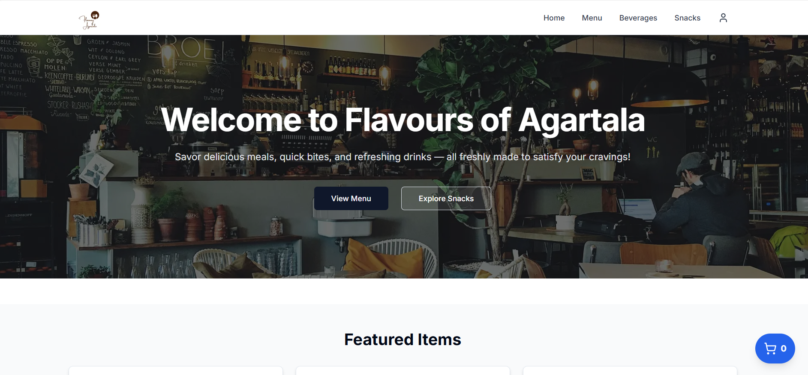
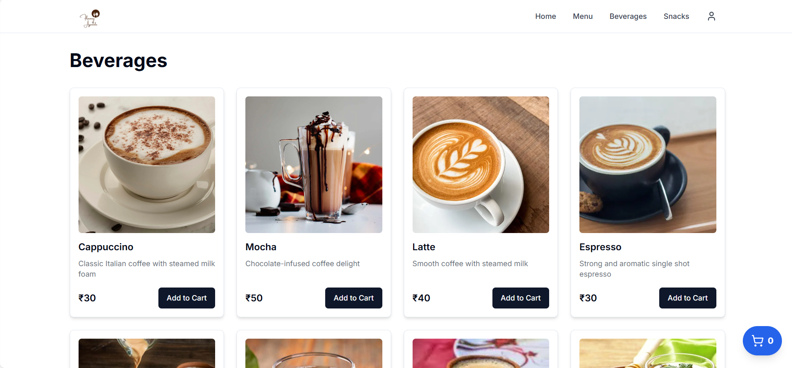
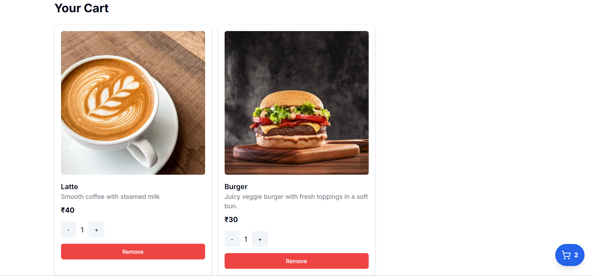
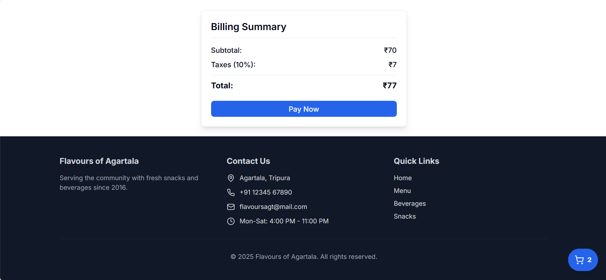

# Flavors of Agartala

### Introduction

Finding and ordering from your favorite restaurant can often be confusing and disorganized. Flavors of Agartala is a comprehensive food ordering system designed to simplify the process of ordering meals from your favourite restaurant. Search, order, and enjoy delicious meals, from the comfort of your homes.

### Features

- **User-Friendly Food Ordering**: Order meals from the restaurant at a convenient time in just few clicks.
- **Hassle-Free Management**: View, edit, or cancel orders effortlessly.
- **Restaurant Dashboard**:
  - Create, update, or remove menu items.
  - Adjust delivery times based on kitchen capacity.
  - Manage customer orders efficiently.
- **Seamless Integration**: Powered by modern technologies to ensure a smooth user experience.

---

## How It Works

1. **User Registration**: Users need to first log in to their accounts.
2. **Basic Information**: Provide the basic personal information.
3. **Food Ordering**: Browse the menu, choose your items and confirm the order.

---

## Tech Stack

### Frontend

- **React.js**: Component-based UI development.
- **Next.js**: Server-side rendering and routing.
- **Tailwind CSS**: Utility-first CSS framework for styling.
- **ShadCN**: Pre-built components to enhance UI.

### Backend

- **Node.js**: Server-side runtime.

    

---

## Screenshots

_**Homepage**_

_**Menu Page**_

_**Cart Page**_

_**Billing Page**_

---

## Future Enhancements

This project is actively being developed, with potential upcoming features like:

- **AI-Powered Menu Suggestions**: Recommend menu based on user preferences.
- **Multi-Language Support**: Provide accessibility for users speaking different languages.

---

## Contributing

We welcome contributions to make HealthPro even better! Please follow these steps:

1. Fork the repository.
2. Create a new branch for your feature or bug fix.
3. Commit your changes and push the branch.
4. Open a pull request for review.
